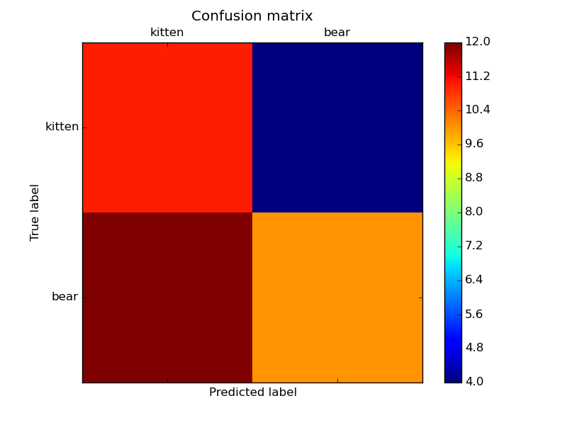

# PREDICT Pipeline


# TRAIN Pipeline


# Pipeline performance metrics


## Kitten vs bear classifier

This repo contains a [brain4k](https://github.com/shuggiefisher/brain4k) pipeline for a kitten-or-bear classifier.  It is intended to serve as
an example of how to train a classifier on imagenet features.  The features
are the activity of the penultimate layer of a convolutional neural network trained
on the imagenet database.

to execute the pipeline within a docker container:

```
sudo docker run -ti tleyden5iwx/caffe-cpu-master /bin/bash
pip install git+https://github.com/shuggiefisher/brain4k.git
git clone https://github.com/shuggiefisher/kitten-or-bear-classifier.git local-path-to-this-repo
brain4k local-path-to-this-repo
```

### Requirements
- [brain4k](https://github.com/shuggiefisher/brain4k)
- caffe, including python wrappers
- scikit-learn
- matplotlib

Installing caffe is quite involved, so you may find it easier to use a
[caffe docker image](https://registry.hub.docker.com/u/tleyden5iwx/caffe/)




Confusion matrix:

[[11  4]
 [12 10]]
